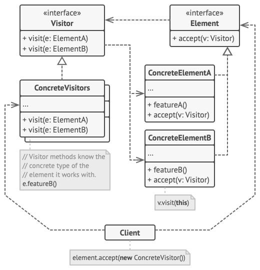
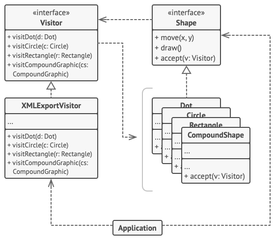

# Visitor Design Pattern

## Definition

Visitor is a behavioral design pattern that lets you separate algorithms from the objects on which they operate.

## Example
### XML export of shapes

Example where visitor goal is to work with different shapes.
It's concrete implementation is the XML exporter where we have all the 
necessary solutions to export a specific shape to XML (Dot, Rectangle etc).
Now every single Shape child has additional method accept(v: Visitor) in which child knows
the needed method to run. Like Dot class will accept Visitor and run visitDot method where 
it passes itself as a parameter. This is called Double Dispatch technique.

The Visitor interface need to have all the "visiting" methods available for all shapes.

## Other

- Example is from awesome website [Refactoring Guru](https://refactoring.guru)
